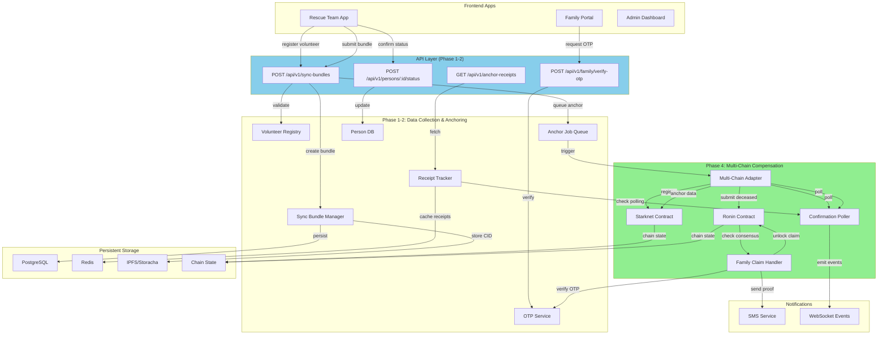
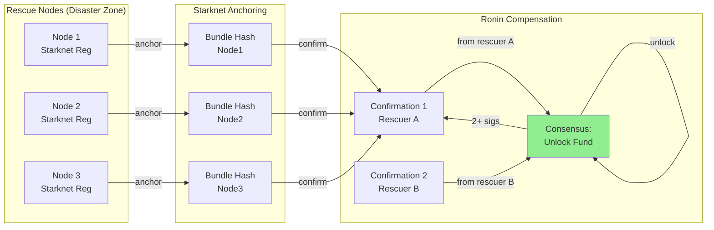
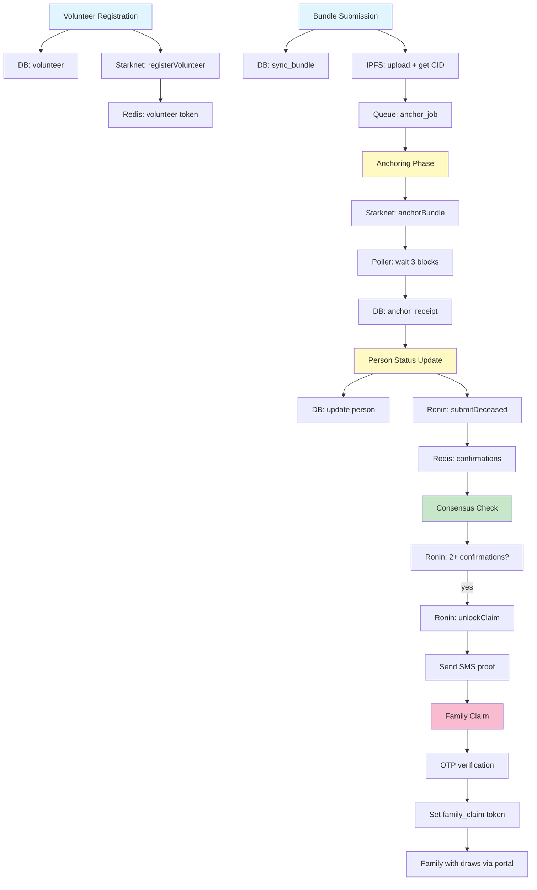

# DisasterNet Full Architecture Diagram

## Phase 1-4 System Overview



## Phase 4 Contract Flow in Detail

```mermaid
sequenceDiagram
    participant Rescuer as Rescue Team
    participant API as API Backend
    participant Poller as Polling Engine
    participant Starknet as Starknet Chain
    participant Ronin as Ronin Chain
    participant Family as Family Portal

    Rescuer->>API: register volunteer + sign
    API->>Starknet: registerVolunteer(publicKey, worldLevel)
    Starknet-->>API: txHash
    
    Rescuer->>API: submit bundle (missing persons data)
    API->>API: create anchor job
    API->>Starknet: anchorBundle(hash, signer)
    Starknet-->>API: receipt
    
    Note over API,Poller: Polling Phase (exponential backoff)
    API->>Poller: start poll(receipt)
    loop Every 1-30s
        Poller->>Starknet: check confirmation
        alt Not confirmed yet
            Note over Poller: wait 1.5x longer
        else Confirmed (3+ blocks)
            Starknet-->>Poller: confirmed!
            break
        end
    end
    
    Rescuer->>API: confirm person is Deceased
    API->>Ronin: submitDeceased(personId, actorId)
    Ronin-->>API: receipt (1st confirmation)
    
    Rescuer->>API: 2nd rescuer confirms Deceased
    API->>Ronin: submitDeceased(personId, actorId2)
    Ronin-->>API: receipt (2nd confirmation)
    
    Note over API: Consensus reached!
    API->>Ronin: unlockClaim(personId, amount)
    Ronin-->>API: fund_txHash
    API->>API: Send SMS proof to family
    
    Family->>API: request OTP
    API-->>Family: OTP sent (demo: 123456)
    Family->>API: verify OTP
    API->>Ronin: check consensus
    alt Consensus confirmed
        API-->>Family: claim_token (JWT)
        Family->>Family: use token to withdraw
    else No consensus
        API-->>Family: error_not_ready
    end
```

## Multi-Node Resilience



## Data Flow: Volunteer → Anchor → Compensation → Family Claim



---

These diagrams show:
1. **Overall architecture** with Phase 1-2 (data) and Phase 4 (compensation)
2. **Sequential flow** from volunteer registration → anchoring → compensation → family claim
3. **Multi-node resilience** showing distributed anchoring + consensus
4. **Data flow** through DB → IPFS → Blockchain → Family Portal

Render these with: https://mermaid.live
